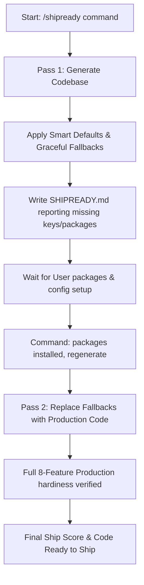

# 🚢 shipready

`shipready` is a production-grade code generator and codebase auditor built as a custom skill for **Claude Code** and rule-based coding agents (**Cursor, Windsurf, Cline, and GitHub Copilot**). 

It is designed specifically for vibe-coded or AI-generated applications (Lovable, Bolt.new, v0, or ChatGPT prototypes). It transforms standard happy-path prototypes into hardened, secure, and production-ready applications across 8 critical dimensions before you ship to real users.

---

## 🌟 The Problem We Solve
Most AI code generators build functional prototypes. They work in a development environment but lack:
* **Security:** No rate limiting, plaintext passwords, SQL injection vulnerabilities, unprotected admin routes.
* **Error Handling:** Unhandled promise rejections, raw stack traces exposed to clients, lack of error boundaries.
* **Database Safety:** No connection pooling (leading to serverless exhaustion), missing database indexes, lack of transactions.
* **API Standards:** Missing Zod validation, inconsistent response formats, non-semantic HTTP status codes.
* **Production Configurations:** Hardcoded secrets in git-tracked files, lack of startup environment validations, missing health checks, unoptimized build containers.

`shipready` fixes this. Every codebase generated or audited by `shipready` meets the standard of a senior staff engineer before deploying to production.

---

## 📐 The 8 Dimensions of Production Readiness

Every file written or audited by `shipready` is checked against these 8 core guidelines:

| Dimension | Standard Requirements |
| :--- | :--- |
| **1. Security** | Password hashing (bcrypt 12 rounds), JWT sessions via NextAuth, Zod input validation, CORS whitelist, NextRequest middleware security headers, route guards for `/admin/*` and `/api/admin/*`, rate limiting on auth endpoints. |
| **2. Database** | Singleton Prisma client (avoids connection leaks), explicit database indexes on all foreign keys and query `WHERE` clauses, Prisma transactions on multi-step writes, database seeding with realistic domain data, schema migrations. |
| **3. Error Handling** | Structured Pino logger (redacting secrets), consistent client-safe JSON error shapes (`{success: false, error: "..."}`), custom React error boundaries, 404/500 routing templates. |
| **4. API Design** | RESTful conventions (GET/POST/PUT/DELETE), request validation with Zod in `lib/validations.ts`, pagination on list endpoints, correct HTTP status codes (200, 201, 400, 401, 403, 404, 429, 500). |
| **5. Environment** | Comprehensive `.env.example` templates, strict startup validation with Zod in `lib/env.ts` (throws fatal error on missing required variables), zero hardcoded secrets. |
| **6. Performance** | Pagination everywhere, selective field queries (`select` / `include`), unoptimized resource protection, Next.js optimized fonts/images, static/ISR page logic. |
| **7. Frontend** | Forms with three distinct states (loading, success, error), disabled buttons on submission, mobile-responsive Tailwind layout, screen reader attributes, clean layout skeletons, empty list states. |
| **8. DevOps** | Multi-stage lean Docker build, `docker-compose.yml` with Postgres + Redis services with healthchecks, `/api/health` health status checks, comprehensive README. |

---

## ⚙️ The Two-Pass Generation Flow

`shipready` uses a two-pass architecture to generate applications, ensuring your project runs cleanly even if external dependencies are missing, while pushing you to achieve production hardening.



### Pass 1: Generate App with Smart Defaults
* Generates your entire application structure immediately from your plain-English prompt.
* If any requirements (external database setups, Upstash Redis keys, Stripe keys, Resend mail tokens) are missing, `shipready` applies **graceful degradation** (e.g. falls back to a local in-memory JavaScript Map for rate limiting, console-logs emails).
* It writes a `SHIPREADY.md` audit report documenting your **Ship Score - Pass 1** along with the list of missing environment variables and smart defaults applied.

### Pass 2: Hardening & Regeneration
* Once you install the required packages and configure the `.env` variables, you trigger Pass 2 by saying `"packages installed, regenerate"`.
* `shipready` parses the `SHIPREADY.md` file, checks the codebase, and swaps all fallbacks with **full production-grade implementations** (e.g. replacing the local in-memory rate limiter with Upstash Redis, configuring live Stripe checkouts, or linking Postgres live database connections).
* It verifies all files against the 8 dimensions and updates your final **Ship Score - Pass 2**.

---

## 📦 Installation

To install `shipready` as a skill for your AI developer agent, clone the repository and run the installer corresponding to your operating system.

### Prerequisites
* Node.js version 20.0.0 or higher.
* Claude Code CLI (`npm install -g @anthropic-ai/claude-code`) or your preferred IDE coding editor.

### 💻 Windows Setup (PowerShell)
Open PowerShell inside the cloned folder and run:
```powershell
.\install-skill.ps1
```

### 🍎 macOS & Linux Setup (Bash)
Open your terminal inside the cloned folder and run:
```bash
./install-skill.sh
```

*(Note: The installer automatically handles directory setups for **Claude Code, Cursor, Windsurf, Cline, and GitHub Copilot** by copying the dimensions and commands to their respective rules directories).*

### 📁 Manual Setup Directory Mapping
If you choose not to run the scripts, you can place the rules files manually based on your tool:

| Tool | Rule Location | Format / File Name |
| :--- | :--- | :--- |
| **Claude Code** | `~/.claude/skills/shipready/` | Copy `SKILL.md`, `commands/`, `dimensions/`, and `templates/` folders. |
| **Cursor** | `.cursor/rules/shipready.mdc` | Combine files (done automatically via `install-skill`) with rule frontmatter. |
| **Windsurf** | `.windsurf/rules/shipready.md` | Single flat markdown instruction file. |
| **Cline** | `.clinerules/shipready.md` | Placed at your project root. |
| **GitHub Copilot**| `.github/copilot-instructions.md` | Appended inside project configuration. |

---

## 🎯 Usage & Subcommands

Once installed, start your coding assistant (e.g. `claude` in your terminal, or Cursor/Cline) and use the following commands:

| Command | Mode | Description |
| :--- | :--- | :--- |
| `/shipready [your description]` | **Generate** | Initiates **Pass 1** to build a brand new hardened app from scratch. |
| `"packages installed, regenerate"` | **Generate** | Triggers **Pass 2** to upgrade all fallbacks in the generated app to production-grade integrations. |
| `/shipready:db [path]` | **Audit** | Audits the codebase at `[path]` against the Database dimension rules only. |
| `/shipready:security [path]` | **Audit** | Audits the codebase at `[path]` against the Security dimension rules only. |
| `/shipready:score [path]` | **Audit** | Scans the files and prints out a detailed breakdown of your current **Ship Score**. |
| `/shipready:scan [path]` | **Audit** | Prepares to scan all 8 dimensions on an existing app (coming in v1.1). |

---

## 📊 The Ship Score Calculation

Every app starts with a perfect score of **100**. Points are deducted based on issues found during audits:
* 🔴 **CRITICAL** issues (e.g. hardcoded credentials, bypassable auth) : **-15 points**
* 🟠 **HIGH** issues (e.g. missing rate limiter, exposed stack trace) : **-8 points**
* 🟡 **MEDIUM** issues (e.g. missing database index, missing form loading state) : **-3 points**
* 🔵 **LOW** issues (e.g. redundant `console.log`, lack of placeholder images) : **-1 point**

### Ship Score Verdicts
* **95 - 100:** 🟢 Production ready. Ship with confidence.
* **85 - 94:**  🟡 Nearly there. Fix remaining HIGH/MEDIUM issues before going live.
* **70 - 84:**  🟠 Significant gaps. Address all CRITICAL and HIGH issues before shipping.
* **Below 70:** 🔴 Prototype-grade. Do not expose to public traffic.

---

## 📂 Repository Structure
```
shipready/
├── SKILL.md            # Main entrypoint loaded by Claude Code
├── install-skill.ps1   # PowerShell wrapper script for Windows
├── install-skill.sh    # Shell wrapper script for macOS/Linux (executable)
├── marketplace.json    # Manifest file detailing specifications
├── README.md           # Documentation
├── bin/
│   └── install.js      # Main Node.js installer script
├── commands/           # Logic files mapping subcommands
│   ├── shipready.md
│   ├── shipready-db.md
│   ├── shipready-security.md
│   ├── shipready-score.md
│   └── shipready-scan.md
├── dimensions/         # Standard rulesets for the 8 features
│   ├── security.md
│   ├── database.md
│   ├── error-handling.md
│   ├── api-design.md
│   ├── environment.md
│   ├── performance.md
│   ├── frontend.md
│   └── devops.md
└── templates/          # Standard Next.js / Prisma template
    └── nextjs-prisma-postgres.md
```

---

## 🤝 Contributing
Contributions to expand `shipready` support (e.g. Drizzle ORM templates, Supabase audits, or Express API deep scans) are welcome!
1. Fork the repository.
2. Create a branch: `git checkout -b feature/your-feature`.
3. Commit your modifications.
4. Open a pull request.

---

## 📄 License
Licensed under a [Custom Individual & Commercial Dual License](LICENSE). 
* **Individual Use:** 100% Free for personal, non-commercial, and educational usage.
* **Commercial & Organizational Use:** Requires a paid commercial license. Please contact `anubhavkakati2004@gmail.com` to arrange commercial licensing.
